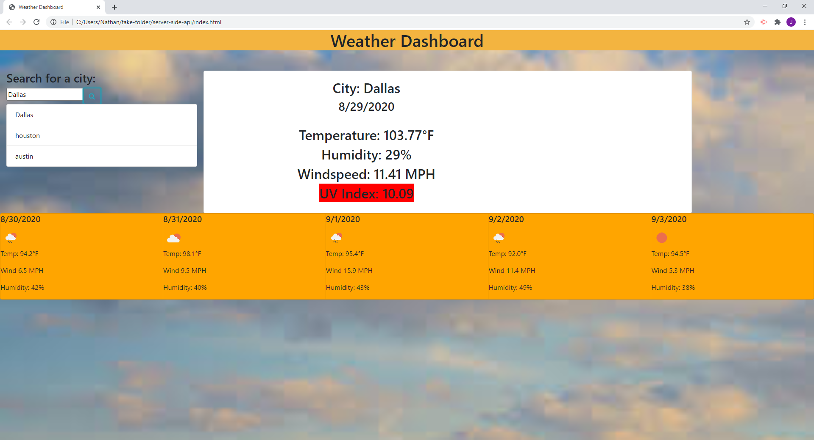

# server-side-api

#My Weather dashboard

In my homework we dive into the openweathermap API! We explore grabbing and utilizing information from the API's given to search from. We went into the objects of these API's and grabbed information we needed to display, such as: city name, temperature, humidity levels, windspeed, and the uv index. We also took it a step further and went into the the API that deals with forecasts 5 days into the future. I had much help from my peers in my class providing a lot of insight on topics I was unsure of. I feel like there are better ways to style the webpage with spacing, but the outcome of this product I am proud of! 

